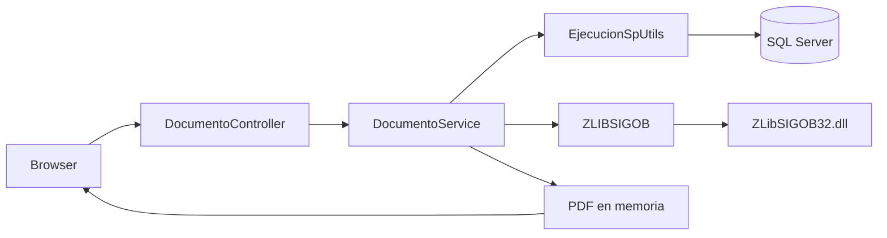

# Documentación técnica

## 1. Objetivo del sistema

Este proyecto implementa un visor de documentos para consultar archivos asociados a una entidad en una base de datos SQL Server. La idea central es permitir listar los documentos disponibles para un código padre y una tabla determinada, y luego devolverlos al navegador como PDF tras una descompresión de contenido ZLIB.

La aplicación no almacena archivos físicos en una carpeta del proyecto; en su lugar, obtiene el contenido binario desde la base de datos y lo transforma en una respuesta HTTP.

## 2. Alcance funcional

### Casos de uso principales

- Consultar documentos por `nombreTabla` y `codigo`.
- Agrupar documentos por categoría.
- Mostrar una vista previa del documento seleccionado.
- Descargar y visualizar el contenido PDF desde la base de datos.
- Procesar archivos comprimidos que vienen en formato ZLIB.

## 3. Arquitectura general

La solución tiene una arquitectura de tipo MVC con capa de servicios:

- Capa de presentación: controladores y vistas Razor
- Capa de dominio/modelado: entidad `Documento`
- Capa de servicios: `DocumentoService`
- Capa de infraestructura: acceso a SQL Server y wrapper nativo de descompresión

### Diagrama conceptual



## 4. Componentes del proyecto

### 4.1 Programación principal

El punto de entrada se encuentra en [MenuDeDocumentos/Program.cs](../MenuDeDocumentos/Program.cs).

#### Responsabilidades

- Crear la aplicación ASP.NET Core
- Registrar servicios de DI
- Registrar `IDocumentoService` como `DocumentoService`
- Configurar rutas MVC por defecto
- Activar el manejo de errores en entornos no de desarrollo
- Mapear controladores y rutas

#### Registro de dependencias

```csharp
builder.Services.AddControllersWithViews();
builder.Services.AddScoped<IDocumentoService, DocumentoService>();
```

Esto permite inyectar el servicio de documentos en los controladores sin crear instancias manuales.

### 4.2 Controlador `DocumentoController`

Archivo: [MenuDeDocumentos/Controllers/Documentos/DocumentoController.cs](../MenuDeDocumentos/Controllers/Documentos/DocumentoController.cs)

#### Endpoints principales

##### GET /Documento/Index

Recibe:

- `nombreTabla` (opcional)
- `codigo` (opcional)

Lógica:

- valida si `codigo` existe y es mayor que cero
- llama a `ObtenerListaDocumentosAsync`
- almacena la colección en `ViewBag.Documentos`
- establece una URL inicial para el primer documento y su nombre

##### GET /Documento/DescargarDocumento/{nombreTabla}/{codigoPadre}/{indiceHijo}

Recibe:

- nombre de tabla
- código padre
- índice del documento hijo

Lógica:

- valida parámetros
- obtiene bytes del documento desde la base de datos
- descomprime el archivo
- devuelve al cliente `application/pdf`

### 4.3 Modelo `Documento`

Archivo: [MenuDeDocumentos/Models/Documento.cs](../MenuDeDocumentos/Models/Documento.cs)

Representa la información mínima que la vista necesita mostrar:

- `Codigo`
- `Nombre`
- `Categoria`

## 5. Capa de servicio

Archivo: [MenuDeDocumentos/Service/DocumentoService.cs](../MenuDeDocumentos/Service/DocumentoService.cs)

### 5.1 `ObtenerListaDocumentosAsync`

Esta operación:

- ejecuta el procedimiento almacenado `sp_PasanteObtenerDocumento3`
- recorre el `SqlDataReader`
- extrae los campos `nombre` y `molde`
- normaliza nombres de archivo para evitar caracteres inválidos
- devuelve una lista de `Documento`

### 5.2 `ObtenerDocumentoDesdeBDAsync`

Recupera el blob binario asociado al documento solicitado por índice. La lógica:

- ejecuta el mismo procedimiento almacenado
- recorre los registros
- compara el contador con `indiceHijo`
- recupera la columna `documento` o `document` según exista

### 5.3 `DescomprimirDocumentoAsync`

Este método es el punto crítico del sistema. Hace lo siguiente:

1. crea un directorio temporal único
2. escribe el contenido comprimido a un archivo `.zlib`
3. bloquea el acceso a la librería nativa con un `SemaphoreSlim`
4. invoca `ZLIBSIGOB.DescomprimirArchivoZLIB`
5. valida que el archivo generado exista
6. devuelve el contenido descomprimido en memoria
7. limpia archivos temporales

El uso de `SemaphoreSlim` evita condiciones de carrera en la librería nativa, que puede no ser segura para usos concurrentes.

## 6. Acceso a datos

Archivo: [MenuDeDocumentos/Utils/EjecucionSpUtils.cs](../MenuDeDocumentos/Utils/EjecucionSpUtils.cs)

Esta clase encapsula la ejecución del procedimiento almacenado. Su comportamiento es:

- abrir la conexión usando `SqlConnection`
- crear el comando `sp_PasanteObtenerDocumento3`
- enviar parámetros `@CodigoDocumento` y `@tabla`
- ejecutar `ExecuteReaderAsync`
- invocar el callback para procesar los resultados

### Parámetros del procedimiento

```csharp
cmd.Parameters.AddWithValue("@CodigoDocumento", codigo);
cmd.Parameters.AddWithValue("@tabla", nombreTabla);
```

Esto confirma que la lógica está fuertemente acoplada a la estructura de la base de datos SIGOB y a un SP específico.

## 7. Descompresión ZLIB

Archivo: [MenuDeDocumentos/Utils/ZLIBSIGOB.cs](../MenuDeDocumentos/Utils/ZLIBSIGOB.cs)

Este archivo define un wrapper P/Invoke sobre una librería nativa llamada `ZLibSIGOB32.dll`.

### Observaciones importantes

- La solución usa interoperabilidad nativa (`DllImport`) para llamadas a funciones no administradas.
- La DLL se copia al directorio de salida del proyecto en [MenuDeDocumentos/MenuDeDocumentos.csproj](../MenuDeDocumentos/MenuDeDocumentos.csproj).
- El proyecto está configurado como `PlatformTarget` x86, lo que obliga a una máquina de 32 bits o a una compatibilidad específica de la DLL.

## 8. Vista y comportamiento en cliente

Archivo: [MenuDeDocumentos/Views/Documento/Index.cshtml](../MenuDeDocumentos/Views/Documento/Index.cshtml)

### Funcionalidad principal

La vista crea dos bloques visuales:

- panel izquierdo: categorías y lista de documentos
- panel derecho: visor del PDF

Un script JavaScript usa `fetch` para:

- obtener el PDF generado por el backend
- convertirlo a un `Blob`
- crear un `ObjectURL`
- asignarlo al `iframe` para visualizarlo sin recargar la página

El comportamiento es muy útil para UX, pero también consume memoria si se cargan muchos documentos en una sola sesión.

## 9. Configuración del entorno

Archivo: [MenuDeDocumentos/appsettings.json](../MenuDeDocumentos/appsettings.json)

La aplicación requiere una cadena de conexión con SQL Server. En el estado actual del proyecto, la conexión está hardcodeada a un servidor específico:

```json
"ConexionSIGOB": "Server=192.168.3.80;Database=SIGOB;User ID=sa;Password=123456789;TrustServerCertificate=True;"
```

### Recomendación

- mover la cadena a variables de entorno o un secret store
- evitar valores sensibles en archivos versionados
- separar entornos (desarrollo, pruebas, producción)

## 10. Flujos reales de ejecución

### Flujo de carga inicial

1. El usuario accede a `/Documento/{tabla}/{codigo}`.
2. El controlador valida el código.
3. El servicio invoca el SP con `@CodigoDocumento` y `@tabla`.
4. Se construye una lista de `Documento` y se guarda en `ViewBag`.
5. La vista renderiza categorías y un visor de PDF con el primer documento.

### Flujo de a selección de documento

1. El usuario hace clic sobre un documento del panel lateral.
2. La vista genera la URL de descarga con parámetros.
3. El navegador llama a la acción `DescargarDocumento`.
4. El backend obtiene el blob del documento desde SQL Server.
5. El servicio descomprime el archivo con la DLL nativa.
6. El frontend asigna el PDF al `iframe` del visor.

## 11. Dependencias y paquetes

El proyecto usa:

- ASP.NET Core MVC
- `Microsoft.Data.SqlClient`
- `Microsoft.Extensions.Configuration`

Archivo: [MenuDeDocumentos/MenuDeDocumentos.csproj](../MenuDeDocumentos/MenuDeDocumentos.csproj)

```xml
<Project Sdk="Microsoft.NET.Sdk.Web">
  <PropertyGroup>
    <TargetFramework>net8.0</TargetFramework>
    <PlatformTarget>x86</PlatformTarget>
    <Nullable>enable</Nullable>
    <ImplicitUsings>enable</ImplicitUsings>
  </PropertyGroup>
</Project>
```

## 12. Riesgos y mejoras recomendadas

### Riesgos actuales

- Dependencia de una DLL nativa de 32 bits
- Hardcoded connection string con credenciales
- Falta de validación profunda del parámetro `nombreTabla`
- Acoplamiento fuerte al procedimiento almacenado específico
- Ausencia de pruebas automatizadas

### Mejoras recomendadas

- Añadir validación de tabla permitida en servidor
- Usar `IOptions` o secrets management
- Mejorar manejo de errores y logging
- Añadir unit tests para `DocumentoService`
- Refactorizar la lógica de descompresión para encapsular la dependencia nativa
- Considerar soporte para arquitecturas x64 si la DLL es reemplazada por una compatible

## 13. Estado de compilación verificado

La solución fue compilada con `dotnet build` y el resultado fue correcto.

Se observaron 3 advertencias:

- `CS0626`: la función nativa no tiene `[DllImport]` en la declaración del método `zlibComprimirArchivo`
- `CS8600` y `CS8604`: posibles nulabilidades en `ZLIBSIGOB.cs`

Esto no impide la compilación, pero sí señala puntos de mejora para robustez y mantenibilidad.

## 14. Conclusión

El proyecto es un visor documental basado en MVC y SQL Server que resuelve la necesidad de recuperar y presentar documentos comprimidos desde la base de datos. Su lógica principal está bien organizada en capas, aunque tiene dependencias sensibles y riesgos operativos por el uso de una DLL nativa, credenciales embebidas y acoplamiento a un conjunto de datos concreto.

La solución es funcional y está preparada para entornos específicos de SIGOB, pero requiere endurecer la seguridad y la portabilidad para una evolución más segura y mantenible.
